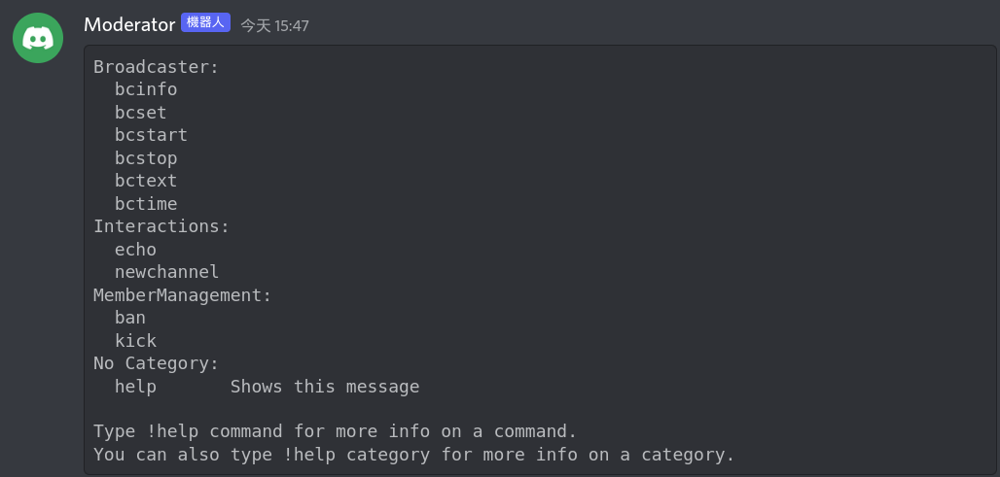
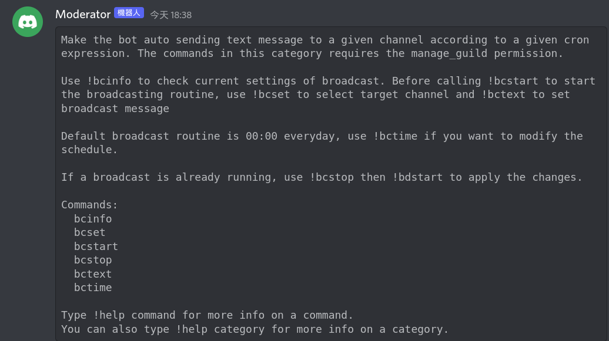
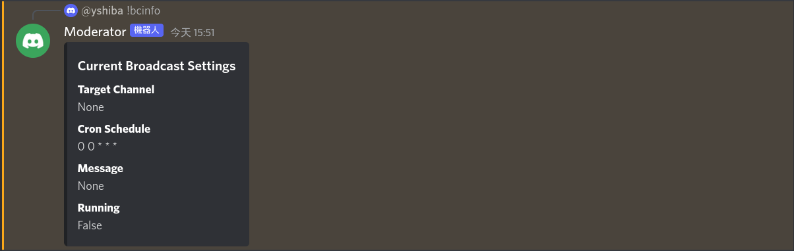

## Bot Command Usage
Commands prefix: `!` (halfwidth)

Type !help to get the full list of commands:

### To use the Broadcaster category:

Type !help Broadcaster in channel to get the usage description from bot:

!bcinfo command to check current setttings of broadcast:

